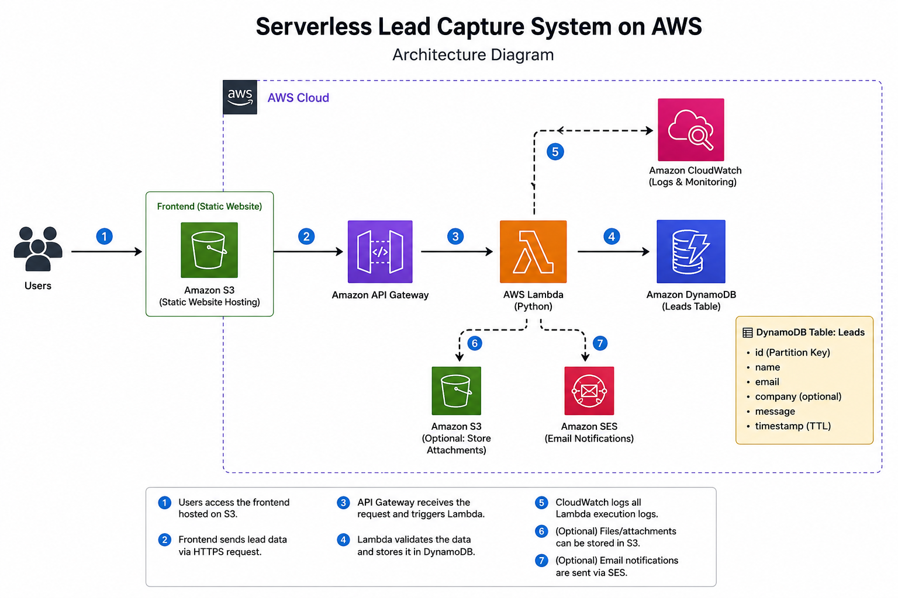
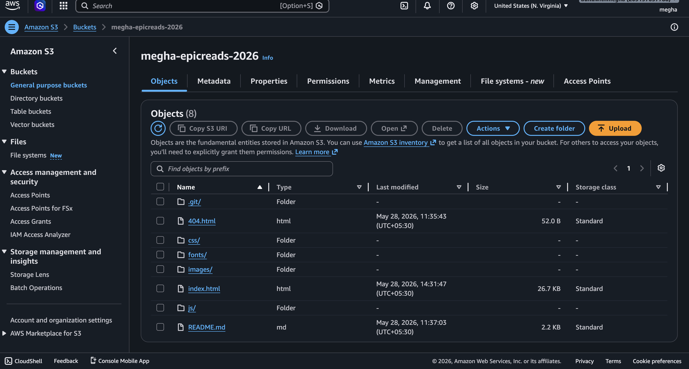
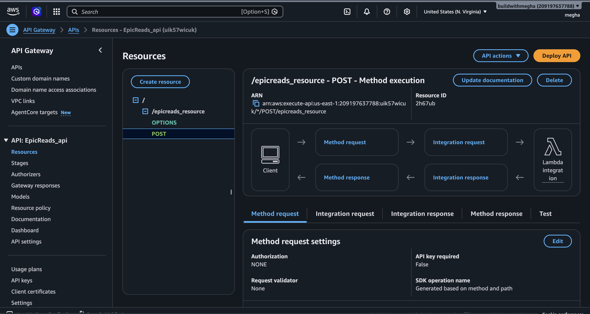
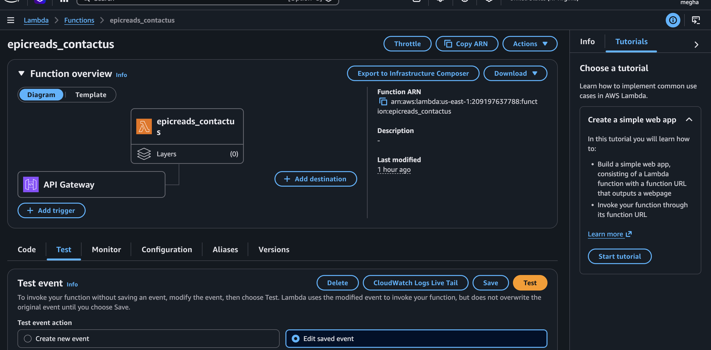
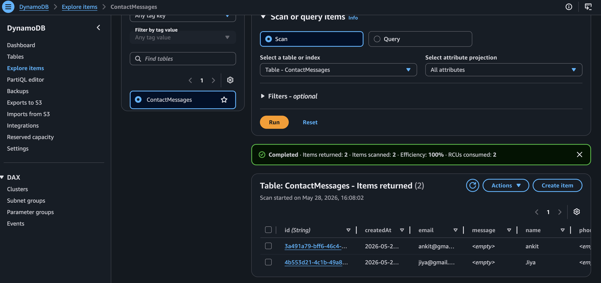
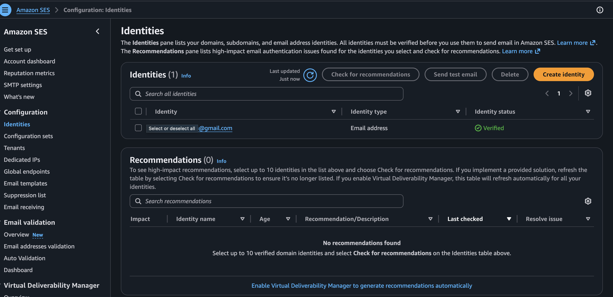
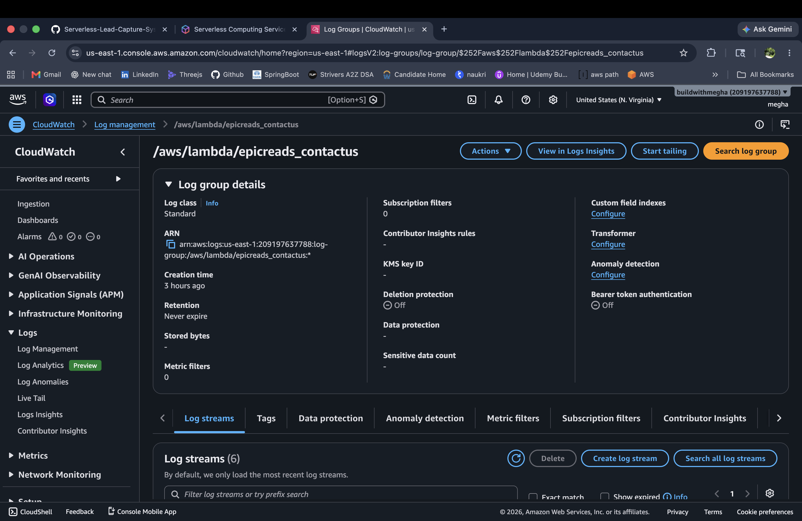
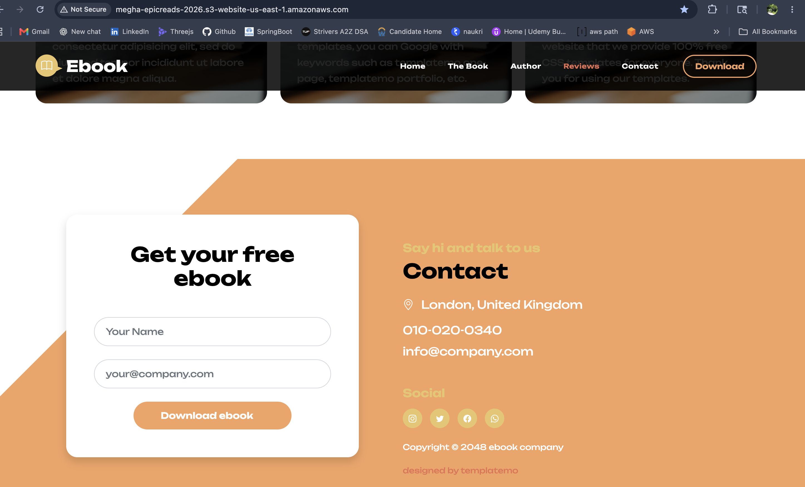

# Serverless Lead Capture System on AWS

A serverless web application built using AWS services to capture and process user inquiries through a website form.

The frontend is hosted on Amazon S3, while the backend uses API Gateway and AWS Lambda to process requests, store user information in DynamoDB, send email notifications using Amazon SES, and monitor logs using CloudWatch.

---

# Architecture Diagram



---

# Live Workflow

```text
User
  ↓
S3 Static Website
  ↓
API Gateway
  ↓
AWS Lambda
 ├── Store data in DynamoDB
 ├── Send email using SES
 └── Save logs in CloudWatch
```

---

# AWS Services Used

- Amazon S3 — Static website hosting
- Amazon API Gateway — REST API endpoint
- AWS Lambda — Backend request processing
- Amazon DynamoDB — User data storage
- Amazon SES — Email notifications
- Amazon CloudWatch — Logging and monitoring

---

# Features

- Static website hosting on AWS S3
- Contact/lead capture form
- Serverless backend architecture
- REST API integration using API Gateway
- Stores user data in DynamoDB
- Sends email notifications through SES
- CloudWatch logging for monitoring and debugging
- CORS-enabled frontend and backend communication
- Fully event-driven workflow

---

# Project Structure

```text
project-root/
│
├── frontend/
│   ├── index.html
│   ├── styles.css
│   └── app.js
│
├── lambda/
│   └── index.mjs
│
├── screenshots/
│   ├── architecture-diagram.png
│   ├── s3-static-hosting.png
│   ├── api-gateway.png
│   ├── lambda-function.png
│   ├── dynamodb-table.png
│   ├── ses-configuration.png
│   └── application-demo.png
│
└── README.md
```

---

# Screenshots

## S3 Static Website Hosting



---

## API Gateway Configuration



---

## Lambda Function



---

## DynamoDB Table



---

## SES Configuration



---
## SES Configuration



---

## Working Application Demo



---

# Application Workflow

1. User enters details in the website form.
2. Frontend sends a POST request to API Gateway.
3. API Gateway triggers AWS Lambda.
4. Lambda:
   - validates request data
   - stores details in DynamoDB
   - sends email notification using SES
   - writes logs to CloudWatch
5. Success response is returned to the frontend.

---

# Challenges Faced

- Configuring CORS between S3 frontend and API Gateway
- SES sandbox restrictions and email verification
- Lambda proxy integration response handling
- API Gateway deployment and method configuration
- Managing IAM permissions for AWS services

---

# Key Learnings

- Building serverless architectures on AWS
- Integrating frontend applications with AWS services
- Working with API Gateway and Lambda integrations
- DynamoDB CRUD operations
- Email automation using SES
- CloudWatch monitoring and debugging
- CORS troubleshooting in distributed systems

---

# Resource Cleanup

AWS resources were deleted after project completion to avoid unnecessary charges. Screenshots and source code are provided as proof of implementation.
